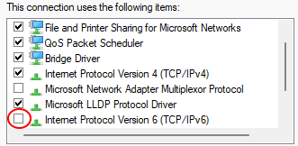

# Failing to pull docker images from mcr.microsoft.com?

**TL;DR; Turn off IPv6.**

Just recently I encountered issues with docker my docker files and compose scripts: it wouldn't build anymore.

After some investigation I could narrow the issue down to a failed `docker pull` from `mcr.microsoft.com`. At least the following images failed:

``` script
docker pull mcr.microsoft.com/mssql/server:2022-latest
docker pull mcr.microsoft.com/dotnet/sdk:8.0
docker pull mcr.microsoft.com/dotnet/aspnet:8.0
```

And they failed with an message like

``` script
... failed to resolve source metadata for mcr.microsoft.com/image/name:version: failed to do request: Head "https://mcr.microsoft.com/some-long-url": EOF
# or 
... failed to copy: httpReadSeeker: to do request: Get "https://mcr.microsoft.com/long-url-with-sha": EOF
```

Strangely enough did `docker pull nginx:alpine` succeed. ???

GitHub issue [#165](https://github.com/microsoft/containerregistry/issues/165) files this issue, but the suggestion of downgrading docker desktop did not work. During further investigation I stumbled upon [#166](https://github.com/microsoft/containerregistry/issues/166). Some of the error messages mentioned occurred also om my machine. 

Some reasoning and Google queries further I experimented with turning off IPv6 in the network adapter on my machine.



After some testing (turn on, reboot, fail, turn off, reboot, success) I concluded: it works!

At least on my machine :grin:!
