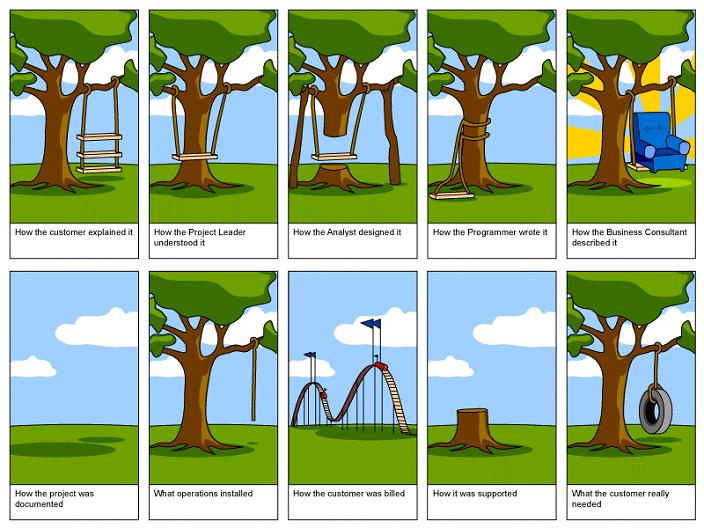

*Over ...*

# De moeilijkheid van Communicatie

Regelmatig schrijf ik in mijn columns over computertalen, haar geschiedenis en paradigma's. Maar het eigenlijke en bovenliggende thema is: communicatie. En vooral de moeilijkheid ervan. Een hele bekende metafoor hiervan is deze onderstaande afbeelding:

De moeilijkheid van communicatie zit veelal niet zozeer in de armoede van taal. Al kan hierin ook nog meer dan het nodige worden verbeterd. De moeilijkheid zit vooral in *wat* we willen communiceren. Vaker wel dan niet zijn dit: concepten, ideeën en/of beelden. Laten dit nu juist de zaken zijn die zich het minst goed onder woorden laten brengen. "Een plaatje zegt soms meer dan 1000 woorden" is niet voor niets een bekend spreekwoord.

Het overbrengen van concepten, ideeën en/of beelden (= communiceren) is in grote mate afhankelijk van het vermogen van de zender om dit in beeld en geluid om te zetten. Dat vermogen varieert enorm van mens tot mens. Daarnaast is er eveneens een hele grote afhankelijkheid van het vermogen van de ontvanger om dit beeld en geluid weer om te zetten in de overgebrachte concepten, ideeën en/of beelden. Ook dat vermogen varieert enorm van mens tot mens. 

Zo sprak ik onlangs met een niet-Engelstalige collega waarbij hij ±15 minuten nodig had om uit te leggen dat hij een eenvoudige if-statement op een bepaalde plek in de code wilde zetten.

Geduld hebben helpt dan ook. Maar ook dat is niet makkelijk.

---

🍐 schrijft elke week een stukje. Over ... van-alles-en-nog-wat. 
En vooral over programmeren, techniek en hoe jij je daar, als &#9432;Naut toe kan verhouden.

---
