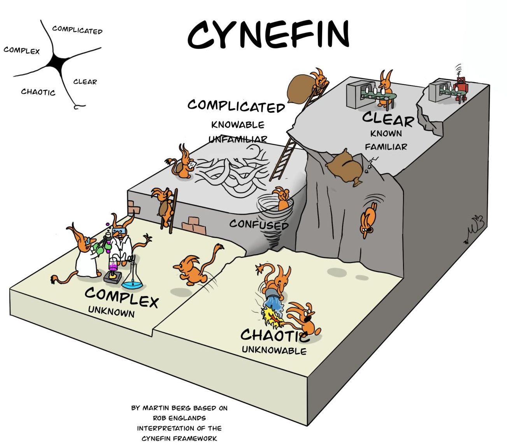

*Over ...*

# Over niet kunnen plannen

Eens, lang, lang geleden, werkte er een programmeur bij een software bedrijf. Dat bedrijf had enorm veel "technical dept". Maar gelukkig was daar een toverfee die zei: "Go Scrum". En er was licht aan het einde van de tunnel.

Dit is een sprookje. 

Er was geen tunnel. En geen licht. Ook geen toverfee. 
Wel enorm veel "technical dept". 

En die programmeur was ik. 

In het ontwikkelteam deden we inderdaad "srum". Met verschillende scrum-masters. In verschillende vormen van Scrum & agile. We hebben veel geëxperimenteerd met organisatie vormen (o.a. sociocratie). Maar het is ons, in al die jaren, niet één keer gelukt ook maar één sprint te halen. Ik vroeg mij dan ook tijdens retrospectives vaak hardop af: waarom plannen we eigenlijk? We hebben inmiddels ruimschoots bewezen dat we geen sprints halen en (dus) niet kunnen plannen. Kunnen we niet iets doen als kanban (niet heel precies wetende wat dat inhoud)?

Pek en veren waren mijn deel :(

Recentelijk bezocht ik een lezing waarbij het planningskwartje viel. Of liever: het gebrek-aan-planning-kwartje. 

Er is een framework dat verklaart waarom we (IT-projecten/sprints e.a.) niet kunnen plannen: het [Cynefin framework](https://en.wikipedia.org/wiki/Cynefin_framework).

Dit framework bestaat uit vier kwadranten:
1. Clear, 
2. Complicated,
3. Complex & 
4. Chaotic.

Hoe complexer of chaotischer, des te onmogelijker het wordt om te plannen. En ons werk bevindt zich voor een groot deel in deze twee laatste quadranten!

Zie ook het verschil tussen [Simple vs. Complicated vs. Complex vs. Chaotic](https://noop.nl/2008/08/simple-vs-complicated-vs-complex-vs-chaotic.html):
1. Simple and complicated systems are all fully predictable.
2. Complex systems are not constructed, they are grown.

**NB:** In eerste versies van het Cynefin framework was "Clear" "Simple".

Doe er je voordeel mee bij de volgende planningssessie.

---

🍐 schrijft elke week een stukje. Over ... van-alles-en-nog-wat. 
En vooral over programmeren, techniek en hoe jij je daar, als &#9432;Naut toe kan verhouden.

---

**PS:** als er toch niets valt te plannen, waar hebben we eigenlijk dan managers voor nodig?
