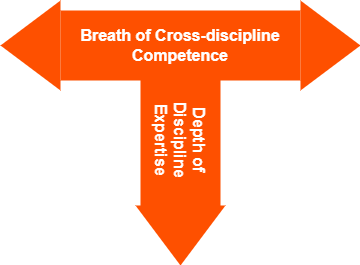

*Over ...*

# Over Lettervermicelli

Bij Incentro zien we onszelf graag als [T-shaped](https://en.wikipedia.org/wiki/T-shaped_skills) consultants. Maar wist je dat er een complete lettervermicelli aan aanduidingen bestaat voor hoe jij ge-"shaped" bent (kan zijn)?

## \-(dash) Shaped

Dit zijn de echte generalisten: weten van alles wel iets maar van iets dan wel weer weinig. Ze weten wel vaak wie er meer van weet. Naar het schijnt heeft "*de business*" steeds minder behoefte aan deze shape.

## I-shaped

Dit zijn de diepgaande specialisten met weinig tot geen kennis buiten hun kennisgebied. Ze staan ook bekend om hun notoir gebrek aan communicatieve vaardigheden. Daarom ook weinig gevraagd door "*de business*".

## T-shaped

Dit is wat we zouden moeten zijn: breed georiënteerd met een duidelijke specialisatie. *Dit* is wat "*de business*" vraagt.

## M-shaped

Maar één specialisatie is natuurlijk niet genoeg. De business wil méér: twee specialisaties! Enter "M-shaped": deze medewerkers hebben diepgaande kennis van verschillende gebieden. Vergeleken met de T-shapes, zijn de M-shaped even goed of meer deskundig dan een T-shaped. De M-ers zijn in feite cross-functionele hoog-presterende teamleden. M-shapers lijken  meer en betere vaardigheden en competenties te hebben dan de T-vormige.

## π-shaped

Dit is een variatie op M-shaped: werknemers met een brede basis en met twee expertisegebieden: de vorm van Pi. 
π-ers hebben een brede basis aan kennis op alle gebieden, maar met vaardigheden in zowel de 'linker hersenhelft' als de 'rechter hersenhelft' disciplines.

## Comb-shaped

Als twee specialisaties niet genoeg zijn, kan de business altijd nog om drie of meer specialisaties vragen: de kam-vormigen. Zij beheersen meerdere specifieke expertisegebieden en ook wat breedte. Deze expertisegebieden zijn echter nooit zo diep als de kennis van een I-specialist in slechts één gebied. Is dit een nadeel? Neen! Omdat de wereld tegenwoordig onderling verbonden *en* afhankelijk is, is er behoefte aan werknemers die kunnen samenwerken door voldoende diepgang te hebben in verschillende gebieden.

## E-shaped

E-shaped is een concept dat vergelijkbaar is met T-shaped: zij hebben diepte en breedte. En meer. Zij hebben een combinatie van 4 E's: Experience, Expertise, Exploration en Execution.

Experience (ervaring) en Expertise (kennis) spreken voor zich. Exploration staat voor een onderzoekende, nieuwsgierige geest. Execution bestaat uit het vermogen om zaken gedaan te krijgen. 
Exploration en Execution zijn, naar mijn mening, essentieel in het huidige technologische tijdsgewricht: zonder beide krijg je niets nieuws gedaan. 

Maar het probleem van E-shaped medewerkers: HR-medewerkers en recruiters evalueren doorgaans alleen Experience en Expertise. En leiderschaps- en managementpraktijken creëren, in traditionelere organisaties, weinig ruimte voor Exploration en Execution. Daar heb je een ondersteunende cultuur en leiderschap voor nodig.

Naar mijn mening zal er in de nabije toekomst de meeste vraag  zijn naar E-vormigen, omdat innovatie vereist dat leiders, medewerkers en teams bereid moeten zijn om te ontdekken, om hun nieuwsgierigheid te bevredigen, en risico's durven nemen om nieuwe ideeën uit te voeren.

In welke letter/shape herken jij je het meest?

Voor meer info:

* [T-shaped skills](https://en.wikipedia.org/wiki/T-shaped_skills)
* [What it is a T-Shaped developer (And why you should be one)](https://letslearnabout.net/blog/what-it-is-a-t-shaped-developer-and-why-you-should-be-one/)
* [Full-stack, T-shaped, M-shaped, comb-shaped, … can we stop it, please?](https://profinit.eu/en/blog/full-stack-t-shaped-m-shaped-comb-shaped-can-we-stop-it-please/)
* [Which Letter-shaped will Future Employees and Leaders be?](
https://www.linkedin.com/pulse/which-letter-shaped-future-employees-leaders-esin-akay/)

&nbsp; 

---

🍐 schrijft elke week een stukje. Over ... van-alles-en-nog-wat. 
En vooral over programmeren, techniek en hoe jij je daar, als &#9432;Naut toe kan verhouden.

---
