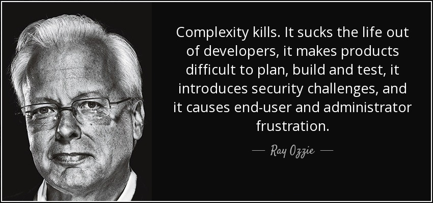

# Programming paradigms are not about software

## Introduction

Welcome to this article. My name is Peereflits. I've been working as a software developer in IT for some 30 years now. In all those years I have seen a number of developments take place that, after some reflection, have settled in my brain. From there, this spun into a story, which I am going to tell you in this article. This story is about programming paradigms, a piece of its history, and the essence and consequence of these paradigms.

---

#### On paradigms

By "paradigm", I use the definition of "[Programming paradigm](https://en.wikipedia.org/wiki/Programming_paradigm)" as stated on [(the Dutch) Wikipedia](https://nl.wikipedia.org/wiki/Programmeerparadigma):
 
> Programming paradigms are thought patterns or pronounced concepts of programming, which differ mainly in the way in which the desired result can be achieved. Some programming languages are designed to support only one particular paradigm, but there are also other programming languages that support multiple paradigms (such as C++, Java and C#).

I consider the ER-model (Entity-Relational model), OOP (Object-Oriented Programming), FP (Functional Programming), Web Programming (Request-Response bases models) to be paradigms.

---

I'm not going to teach you new technologies or techniques here. I just hope to give you more insight into *why* behind *what* you're doing. So this article doesn't cover specific computer languages. However, some knowledge about this is desired. Therefore, this article is intended for programmers who know at least an object oriented language, such as Java, C#, C++ or Python.

I know very well *what* I want to tell you, but not exactly *how*.

---

#### On *how* and *what* (declarative versus imperative)

The questions *what* and *how* are of fundamental importance within the world of software development.

> Computer languages are classified in [declarative languages](https://nl.wikipedia.org/wiki/Declaratieve_taal) and [imperative languages](https://en.wikipedia.org/wiki/Imperative_programming). Very briefly, one writes down in a declarative language only *what* must be done, and in an imperative language *how* something must be done to achieve *what*. A perfectly clear distinction cannot be made.<br/>--- *Wikipedia* ---

A function in an imperative language shows the difference: the signature of a function reveals "*what*" it does; a body of a function describes "*how*". See the example below:

``` java
public int Add(int term1, int term2) {
  return term1 * term2;
}
```

The function signature (the *what*) says that it adds two numbers and returns the result (the sum). The body of the function (the *how*) says how it does this: by multiplying the first input variable by the second.

In declarative languages, such as SQL, the *how* no longer needs to be asked; that is solved by a "runtime" for you. In the case of SQL this is the RDBMS. Therefore, you only have to concentrate on the question *how*.

Programming paradigms also try to answer a "what?" problem. Each computer language has its own dialect in which it tries to answer this question by telling it in its own way. I do come back to it.

> **Note** 
> Do you see in the example above, *all* errors in the code? There are three! And these three are each to be divided into a separate category. Assume calling `Add(2147483646, 2);`.
> 
> 1. Logical error: this is the result of a difference between *actual* outcomes and *expected* outcomes;<br/>Based on the function name (*what* does it do?), the result of the function would be `2147483648`; not `4294967294`. But perhaps the outcomes are correct (*how* does the function work?) and the name is wrong.<br/>**PS:** The most vicious part is that it is explicitly my intention to mislead you. If I am successful, the function is good :smile:; But of course this "fault" is a flagrant violation of the adage "Use Intention-Revealing Names." See page 18 in[Clean Code](https://www.amazon.com/Clean-Code-Handbook-Software-Craftsmanship/dp/0132350882).
> 1. Technical error: this is an error due to changes "in the environment" and/or anticipated usage; What happens when the call occurs? An "Integer Overflow." Defensive programming, proper error handling and the philosophy of "Never trust public input" are methods to mitigate this type of error;
> 1. Functional error: A functional error occurs when a function can or do less (or does too much) than what is expected. Take, for example:`Add(1.5, 3.333);` or `Add(1,2,3);`.

---

Well, I digress. I want to talk about some paradigms in computer science, in software development.
 
> Computer science is no more about computers than astronomy is about telescopes.<br/>-- *[Edsger W. Dijkstra](https://quotefancy.com/edsger-w-dijkstra-quotes)* --

---

#### On the difference between software and hardware

What is the difference between hardware and software?

* With "hardware" we make a machine (or component) that behaves according to rules that we cannot change.<br/>We cannot suddenly modify the instructions set of a processor.
* Using software we create a machine that behaves according to rules we can adapt.<br/>In a program we can modify the behavior of a click on a button (if the source code is available).

"We", in this case, is a "developer". Therefore, be aware that **if you write code that is so hard to maintain that it can no longer be modified, then you are not a "developer" but a hardware engineer!**

---

The themes I want to discuss are:
* Databases (Relational & NoSQL)
* Object orientation
* Functional programming
* Web programming
* Cloud computing


## databases

Who makes use of a database when creating new applications? And which one of you uses a *relational* database?

---

#### On "relational" in relational databases

What is the relational thing in relational databases? Pick Figure 1 or Figure 2?

*<br/>*Figure 1*

*<br/>*Figure 2*

It's "Figure 1": in database parlando a table is called a relation, as the value in a table is found at the intersection of a tuple and an attribute. The fact that there can be a "foreign key constraint" between tables (Figure 2), is not the reason why a relational database is called "relational"; it is because the data is stored in a table format.

<br/>*Figuur 2*

See: [Why are Relational Databases “Relational”?](https://vertabelo.com/blog/why-are-relational-databases-relational/)

So far this aside :smile:

---

### The "Why"

*Why* do we use relational databases?

Because relational databases have existed for so long, entire generations of programmers have grown up, since the 1970s, with the ubiquitous availability of databases such as MySQL, Ms Access, SQL Server, Oracle and others. Thinking in tables has become commonplace. So as "we" think in terms of "save" of POJO's / POCO's / records / models / entities, we think almost immediately about "tables." And thus we think relational databases. Even with the relatively recent emergence of NoSQL databases, it's no different (I will come back to this).

Maybe I should ask the question differently:<br/>*What* is the problem that relational databases are trying to solve?<br/>Answer: solving the problem of structured data storage.

What's the problem?

Before there were any relational databases, programmers had to program systems themselves (=databases) with reading and writing from and to files (=tables). That was (and is) a pagan job. And you can imagine that many errors were made. Besides the time-consumingness and error sensitivity of that job there was another problem: disk space at that time was very-very-very expensive.
 
> **Note**
> For an overview of disk & memory storage, see:
> * https://en.wikipedia.org/wiki/History_of_hard_disk_drives
> * https://www.computerhistory.org/timeline/memory-storage/

In 1970 Dr. Codd ([Edgar F. Codd](https://en.wikipedia.org/wiki/Edgar_F._Codd)) wrote the groundbreaking article "[A Relative Model of Data for Large Shared Data Banks](https://learnsql.com/blog/codd-article-databases/)" in which he proposed to describe databases based on relational algebra. This is now called the relational model. This model had a number of very big advantages compared to the "network database model" and "hierarchical database model" at the time. Network and hierarchical databases were very expensive and complex in development and maintenance. Using the relational model, one could manage data much more easily than the older storage models.

Based on this article, [SQL](https://learnsql.com/blog/history-of-sql/) was born and the principle of [database normalization](https://en.wikipedia.org/wiki/Database_normalization). Data normalization is a method of modelling redundancy out of collections. A big advantage is that data storage in this form takes up much less space (if at least you use the third normal form (3NF). And this was (and is) true when compared to the other types of data storage at that time. Again: disk space was very expensive in the 70s and 80s.

---

#### On cheap storage

Is storage cheap nowadays? Compared to the prices of years ago, it does indeed seem that the price per GB/TB has fallen enormously. But that doesn't mean that we don't have to think about how we store things in a database anymore. The cost of storage is more than just the cost of disk/GB. Think about the size in memory, the size "on the wire" and the time it takes to process data (or a file)!

`More disk size == more read/write time == more throughput == more bandwidth == more memory usage == more energy == more money`

---

The essence of databases is that it "lives" on the hard drive. This medium, disk, knows its own language: `READ` & `WRITE`.

> **Note** 
> Some disks have little to do with disks anymore, but the 'D' in SSD is still that of "disk."

---

#### On delete

There is no "delete" of a file on disk. In a delete, the address of the file allocation is "gummed" (overwritten with zeros) from the file allocation table (File Allocation Table) of the OS, which allows the "hole" in the allocation to be overwritten by other files.

---

The disk derived database language (SQL) knows its own grammar: CRUD.

* **C**reate (INSERT) = Write, append to file
* **R**ead (SELECT) = Read from file
* **U**pdate (UPDATE) = Overwrite in file
* **D**elete (DELETE) = Overwrite with 0000

> **Note** 
> CRUD is only one of three language variants within SQL:
> 1. **DML**: Data Manipulation Language (SELECT, INSERT, UPDATE, DELETE)
> 1. **DDL**: Data Definition Language (CREATE, ALTER, DROP)
> 1. **DAL**: Data Authorization Language (GRANT, REVOKE, DENY)

The medium "disk" has its own language (r/w). Databases "living" on this medium and have a paradigm that relates to this medium. The database paradigm/language (SQL) is therefore, in essence, about reading and writing files to disk. And managing its complexity is solving the problem of structured data storage.

The fact that there is no such thing as "inheritance" in databases is because this is a concept that does not apply in the problem domain of "structured data storage."

The *reason d'être* of "disk" is to enable "durable" state.

In th end databases (RDBMS) were created to manage more efficient and cost-effective scheme-based (structured) data at durable state (= disk).


### NoSQL databases

As the problem of "expensive disk space" became less and less of an issue, due to developments in that area, and in conjunction with increased computing power and interconnectivity between systems, the amount of data entering databases began to grow to an amount that was not thought possible a decade before. And not only the *amount* of data became increasingly challenging. There was also an increasing need to be able to query "unstructured" data (such as PDF documents).

As a result of this need, a number of large tech companies began to experiment with the construction of large distributed databases. This marked the end of the era of the reigning relational database (read: SQL). Thus was born the **N**ot-**O**nly-**SQL** movement, with its [different types of databases](https://www.geeksforgeeks.org/types-of-nosql-databases/ "Types of NoSQL Databases"), each of which in turn tries to solve a specific problem: the problem of managing massive amounts of data in a distributed environment.

NoSQL databases have been developed to manage more efficient and cost-effective non-schematic (unstructured) data at (distributed) durable state.

> For more info:
> * [Difference between SQL and NoSQL](https://www.geeksforgeeks.org/difference-between-sql-and-nosql/)
> * [The CAP Theory in DBMS](https://www.geeksforgeeks.org/the-cap-theorem-in-dbms/)


## Object orientation

Which one of you uses an object-oriented language and/or framework when creating new applications? And most importantly, *why* do you use it?

Obvious answers are: this is what I learned at school or on the job; this is used at the customer/in the project; But why is this taught in training courses? It is demanded by the industry. And why is the industry asking for object-oriented languages?

To solve a problem! The leader of a solution is not called "Solution Architect" for nothing. Which problem? What kind of problem?

Object orientation is an answer to the problem of increasing complexity.
 
> Good object orientation is the efficient and effective application of a "divide and conquer" tactic to complexity.<br/>-- *Peereflits* --

In order to understand what that complexity means, we need to look at the history of computers and their programming languages first.


### The history of increasing complexity

> In the beginning when we had no computers, we had no problems.<br/>Then when we had small computers, we had small problems.<br/>Now that we have big computers, we have big problems.<br/>-- *Edsger W. Dijkstra* --

When the first computers were developed, the profession of "software developer" did not exist. The first programs that were written, consisted mainly of a huge sequence of written processor instructions. Scoping of routines was only possible by the usage of `GOTO` statements. As a result computer programs were hardly readable and this type of code was soon called "spaghetti code." The programs were written in among others. Programs were written in languages like [Assembly/assembler](https://en.wikipedia.org/wiki/Assembly_language), early versions of BASIC, Fortran or COBOL. Batch files are still another example of [non-structured programming](https://en.wikipedia.org/wiki/Non-structured_programming), as the languages from that time were called ('50/'60). An important characteristic of code from that time was the scoping of routines by `GOTO`.

> **Note**
> The basis of each programming language consists of three "[programming constructs](https://www.bbc.co.uk/bitesize/guides/z433rwx/revision/1)": [sequence, selection & iteration](https://www.101computing.net/sequencing-selection-iteration/).

In order to cope with the problems of "spaghetti code" computer languages were enhanced with [block structures](https://en.wikipedia.org/wiki/Block_(programming)) and [subroutines (functions)](https://en.wikipedia.org/wiki/Function_(computer_programming)). And so came "[Structured programming](https://en.wikipedia.org/wiki/Structured_programming)". An important characteristic of structured programming is that routines are scoped by functions and/or subroutines.
 
> **Note**
> The Dutch professor [Edsger W. Dijkstra](https://en.wikipedia.org/wiki/Edsger_W._Dijkstra) is credited with having invented the term "structured programming".

And then life was beautiful again ... until ...

As you know, you can add parameters to functions, and here the fairy tale of structured programming begins to show cracks.

Function modules from that early time were (sometimes) huge libraries with nothing but (public) methods. Windows libraries like `kernel32.dll` and `user32.dll` are still nothing but large bins with "procedural" functions. And if a method/function had to support more or other functionality, then parameters were often added to a function to support that functionality.

> **Note**
> I once encountered a method (in Visual Basic) in which the signature consisted of 22 parameters and was 2409 characters long to read. The body of the function was a huge spaghetti of `If-Then-Else`'s and loops. This was over 800 lines long. :cry:

If the number of parameters of a function increases, the [cyclomatic complexity](https://en.wikipedia.org/wiki/Cyclomatic_complexity) increases. Cyclomatic complexity is determined by the amount of possible paths that code can pass in a function. Greater cyclomatic complexity == more complexity. And we also know: **Complexity kills!**

<br/>-- *Ray Ozzie* --

When a number of clever minds thought about this, the idea arose: what if we could encapsulate the behavior and associated data of a functionality (= one function) in one construct, one thing, one object... ? And voilà: here you have "object orientation."


### Object orientation (OO) 101

[Object orientation](https://en.wikipedia.org/wiki/Object-oriented_programming) was already "invented" in the 1960s. But it took until the late 1980s for OO to become really commonplace. Also, OO is now understood differently than in its original phase. Things like "inheritance" & "polymorphism" are not concepts in the original OO design. See [The Forgotten History of OOP](https://medium.com/javascript-scene/the-forgotten-history-of-oop-88d71b9b2d9f). The fact that people think differently nowadays about OO is partially a result of the fact that many OO-languages are multi-paradigm computer languages.

Who knows what the four basic principles of OO are? Look on internet for "four tenets/pillars/principles of object oriented programming" and you get this list:
* Encapsulation
* Abstraction
* Inheritance
* Polymorphism

Definitions that are often given for each of these concepts are often taken over from other sources. And as a result, I believe that information has been lost that can contribute to the better understanding of OO (in the current context).


#### On encapsulation

This is often defined as "the internal representation of an object (=state) is not visible outside the object". Usually only the object's own methods can directly inspect or manipulate the fields (=state). Often, "access modifiers" (`public`, `internal`, `protected`, `private`) are mentioned in the same breath as encapsulation as how this is achieved.

But that's only part of the story. Encapsulation, in my opinion, is about merging behavior and its corresponding data into one single construct. The problem with structured programming was that methods/functions were given more and more parameters which increased complexity. By including the parameters of a function as separate fields/properties in a construct, the function can be simplified (and possibly become multiple functions). And this "construct" is by now in OO-languages known as `class`.

> **Note**
> The more an application looks like a "Line of Business" application, the more classes become data-oriented (record-like). When a library has more framework-like characteristics, `classes` will get a more function-oriented nature in which the principles of OO are better reflected.


#### On abstraction, inheritance and polymorphism
 
> Program against abstractions, not concretions.<br/>-- *OO Design principle* --

"Abstraction" is often referred to as something that is modeled on something from "real" reality. Sometimes the concept of "interface" is also mentioned. "Inheritance" defines a "is-a" or "has-a" relationship between objects (a fish "is-a" animal). And "Polymorphism" is a "it-can" relationship between objects (a bird "can" fly).

> For each problem in OO, there is a correct level of abstraction. Except for the problem of too many abstractions.<br/>-- *A statement of[The Problem Solver](https://www.theproblemsolver.nl/)* --

But that's not the point at all! These three terms are all about one thing: contract! Abstraction (=interface) as well as inheritance and polymorphism are expressed in the same way in C#:

``` csharp
    public interface ICanFly { ... }
    
    public abstract class Animal { ... }
    
    public abstract class Mammal: Animal { ... }
    
    public class Bat: Mammal, ICanFly { ... }
```

In all three cases the inheritance operator "`:`" is used. Why? In all cases it's about the fact that a `class` complies with a contract. And why is *that* important?

When OO began to take off, "inheritance" was praised as one of its most important features. But this jubilee was mainly done by IT-managers who translated "inheritance" into reusability. Microsoft's documentation still mentions this:

> Inheritance enables you to create new classes that reuse, extend, and modify the behavior defined in other classes.<br/>-- *[source: microsoft](https://learn.microsoft.com/en-us/dotnet/csharp/fundamentals/object-oriented/inheritance)* --

I create a new kind of functionality (=`class`). You want this functionality, too, but just a little bit different. Then you will inherit my class and adjust the behavior to your taste and do not have to rewrite everything (including the bugs) and you don't break existing implementations. See here: reusability by "inheritance."

The developer is happy because simple (ahum). The manager is happy because the developer finishes the job faster (with less bugs). Company happy, because faster = cheaper.
 
> Favor polymorphism over inheritance.<br/>-- *OO Design principle* --

But there is another story behind this "inheritance" / reusability. And it starts with the question: where "lives" a (in a OO-language written) program? In which medium?

Programs live primarily in the RAM of a computer. That will surprise no one. Computer languages and compilers should be able to handle memory smartly and manage it. The real reason behind the contract orientation of OO lies in the fact that fixed contracts are better manageable.

And here my reasoning is starting to get shaky. I once read an article years ago that meant the start of this story. Unfortunately, I can't find that article anymore. Especially one of the images there was an eye-opener for me. For the first time, it finally made sense!

In that article, the author explained that in an object hierarchy of inherited objects in a OO-language (C++?) parts of memory blocks were reused because they shared the same memory layout. Something with pointers, structures and v-tables etc. In the image below this was schematically very enlightening. Having the same memory layout was possible because a "contract" was met (a fish "is-one" animal). This allowed memory blocks to be shared and memory space was normalized (read: as in de-duplication). This normalization then led to a smaller memory footprint and that was profitable again. Because in that time memory was expensive and certainly not unlimited addressable. Who still remembers the 640Kb limit in MS-Dos?

**Note**
> Managing memory is something that can easily go wrong when you have to do it yourself (read: null-pointers). In languages like C++ this can still be done manually. It's visible in the available methods to allocate/de-allocate memory blocks and to be able to work with pointers(*) and memory addresses (&). Java & .NET/C# are "purposely" invented to solve this problem.

OO is also said to be about managing state. Inheritance = reusability of functionality + reusability of code + reusability of memory.

> OO is about managing state.<br/>-- *General opinion* --

A characteristic of (RAM) memory is that it is very volatile. `RAM == volatile state`. The grammar of managing this "volatile state" consists of concepts such as: heap, stack, struct, v-table, allocation, de-allegation, GC, lock, etc. and is a very complex matter. [Object orientation](https://en.wikipedia.org/wiki/Object-orientation) is an attempt to answer this complex problem.


## Functional programming (FP)

With the arrival of F# in .NET, [Functional programming](https://nl.wikipedia.org/wiki/Functioneel_programmaren) has gained a little more attention in the world of software development. Interest has also increased as advances in hardware make functional programming languages easier.

But *why* do we need functional languages (and the associated paradigm)? So the question that needs to be asked is again: what problem solves FP?

When I once, years ago, attended a session at [User group dotNed](https://www.dotned.nl/), in which [Oliver Sturm](https://www.linkedin.com/in/oliversturm/) explained some things about FP, it made sense a second time!


### The problem of OO

In OO, as we have seen before, behavior and state are encapsulated in a class. The internal state of an object should of course not be revealed to the outside world. The internal state may only be changed by the public methods (mutators) of an object. These mutators must therefore carefully inspect the parameters and validate the internal state before changing the state. Programming is human work (despite the recent arrival of ChatGPT). And people make mistakes. The state of an object is "leaked" more often than is desirable, which in turn creates all kinds of side-effects, which in turn produces errors, which in turn causes costs/annoyance/complexity... You get the drill.

Managing state is complex, and "OO is about managing state." Enter Functional programming.


### functional paradigm 101

The paradigm of functional programming is to eliminate state by describing "everything" in the form of functions. But are we back to structured programming?, I can already hear you thinking. But no. This paradigm is based on the mathematical theory of the [Lambdacalculus](https://nl.wikipedia.org/wiki/Lambdacalculus). It is a higher level of thinking, understanding and calculation where functions have no side-effects because these functions have no state (also called "pure functions" in FP). And the parameters of a function can also be described as a function (also called [currying](https://en.wikipedia.org/wiki/Currying)). In other words, a function can take another function as an argument. Functions in FP are often referentially transparent. This means that an expression can be replaced by its value without changing the behavior of the program.

This is, in a very tiny nutshell, the core of FP. But the essence of FP lies in the fact that because a function (at its lowest level) is stateless, there are no side-effects. This makes it much easier for FP programs to perform their computations in parallel.

In FP, therefore, a function lives on a processor-thread. And with the advent of multi-core processors, FP can solve the problem of inefficient processor usage (unused processor capacity).

Do you want to know more about FP/F#? [F# for Fun and Profit](https://fsharpforfunandprofit.com/) )is a site that gave me (at the time) a lot of insight into this.


## Web programming

The Internet has become an indispensable part of our lives. In fact, everyone who reads this owes (directly or indirectly) his bread to it. Many of us work on or consume web APIs.

But what is it about the internet that has made it so immensely popular? One of the biggest problems the Internet solves is the locality of data.<br/>**Note:** On a technical level, it solves the problem of RPC (Remote Procedure Call).

In the early days of the large computers (1950s-1970s), programmers had to ride their bicycles, carrying a lunch box with punch cards, to a computer center to have their code compiled and executed. Mainframes had terminals that programmers had to go to, to get something done from a computer.

In the 1980s, with the arrival of the PC, this problem was partly solved. After the Mainframe, client-server systems emerged. Especially with "fat clients" the problem arose: how do I get a new version of my client application on the user's PC? Spoiler alert: Internet!

> **Note**
> Microsoft's mission statement in '80 & '90 was: A computer on every desk and in every home. See: https://www.businessinsider.nl/microsoft-ceo-satya-nadella-bothered-by-bill-gates-mission-2017-2

The emergence of internet (in the Netherlands [in the 1990s](https://nl.wikipedia.org/wiki/Geschiedenis_van_het_internet_in_Nederland "History of the Internet in the Netherlands")) was, with "a computer on every desk and in every home", and the availability of internet to the general public by ISP's and [Mosaic](https://en.wikipedia.org/wiki/Mosaic_(browser)), unstoppable.

Due to the growing availability of computers, cables, (standardized) protocols and applications (browsers and servers) internet could be created. Internet meant, and means, that "all" information for "everyone" is available "everywhere". That public ubiquitousness of information also works as a [Democratic force](https://assets.cambridge.org/97811070/49130/excerpt/9781107049130_excerpt.pdf "The internet as a democratic force").

Internet also meant that the deployment problem with client server applications could be solved. And with increasing maturity and functionality in protocols (HTML5) and applications (=browser) client server systems were dying[\*].

So, what's left is: we have to develop applications "on the Internet." These applications consist of a client[\*] part (front-end) and a server[\*] part (back-end), each of which has its own technologies/languages/frameworks at its disposal. Of course, that doesn't seem useful. However, both differ because they solve both different problems: the client app "lives" in the browser on the screen; the backend application "lives" in the memory of a server.

[\*] The term/understanding "client-server" stays rudimentary alive.

> **Note**
> The front-end stack consists of three different technologies, each with its own responsibility for content:
> * HTML = Structure of content (declarative)
> * CSS = Layout of content (declarative)
> * JS/WASM = Behavior of content (imperative)

But the essence of a web application is that it "lives" on the cable (Wifi is a virtual cable). And a cable is stateless. In a cable, a signal can only go from the client to the server or from the server to the client. And with this the Request/Response model is a fact.

The grammar of the Request/Response-model consists of[ABC](https://en.wikipedia.org/wiki/Windows_Communication_Foundation):

* **A**ddress: this is the URL of the endpoint. *Where* do I find the resource;
* **B**inding: specifies the communication &amp; security protocols to be used. *How* do I query the resource;
* **C**ontract: defines the resource interface. *What* can I ask of the resource;

The cable solves a locality problem. To do so, it uses a language (ABC) that can address it. Therefore, web programming (at its edges) has no such thing as polymorphism, inheritance, etc. See the code below:

``` java
    @GetMapping("/articles")
    public VehicleSearchResponseDto articles(
       @RequestParam(required = false) String category,
       @RequestParam(required = false) String vehicleType,
       @RequestParam(required = false) String brand,
       @RequestParam(required = false) String model,
       @RequestParam(required = false) Integer page,
       @RequestParam(required = false) Integer limit
    ) {
       VehicleSearchRequestDto dto = new VehicleSearchRequestDto(category, vehicleType, brand, model, productionYearRange, version, keyword, page, limit);
       return vehicleService.searchArticles(dto);
    }
```

The`@GetMapping("/articles")`addresses a part of the A of the ABC. But a "request object" as a complex type does not exist in a cable. Therefore, the parameters of the request must be defined as queryering parameters before they can be delivered over a cable to the server. Frameworks like Java Spring and ASP.NET do a lot to brush away the "paradigm mismatch" but somewhere it always keeps sanding when you cross the boundary of a paradigm (= the boundary of a medium). In this case, it goes from OO to Web (read: from memory to cable). In case of database interaction it is from OO to RDBMS (read: from memory to disk).

> Crossing the boundaries of a paradigm always aches due to a paradigm mismatch (like the object-relational mismatch).<br/>-- *Peereflits* --

> **Note**
> In both Java/spring and .NET core nowadays only JSON over HTTP is used as a binding. Protocols such as SOAP over HTTP, SOAP over TCP and SOAP over MQ have become obsolete. As *contract* [OpenAPI](https://www.openapis.org/) is currently used.
> **NB:** SOAP used WSDL as a contract language.

Although a cable is stateless by nature, web applications have a hybrid form of state that is also called "sticky state". It provides the state in a request by using HTTP headers, query strings, cookies or request body (POST/PUT only). This state lies with the client of the web application and leans on the statefulness of the device (=desktop/laptop/tablet/smartphone).

Will the future show us that FP-languages will replace OO-languages because they're a better fit to the Web-programming paradigm, as FP and internet/HTTP are both stateless by nature?


## cloud computing

A lot is written about Cloud computing: it is hip & happening. And although I can tell you about this, I run the risk of telling you what others have already blogged, podcast or streamed.

So right away: Why Cloud computing? To solve the problem of unused hardware.

Setting up a good server park is expensive; and not making full use of it is even more expensive (a higher TCO).[OpEx above CapEx](https://github.com/undergroundwires/Azure-in-bullet-points/blob/master/AZ-900%2520Microsoft%2520Azure%2520Fundamentals/6.2.%2520Capital%2520Expenditure%2520(CapEx)%2520vs%2520Operational%2520Expenditure%2520(OpEx).md).Therefore, see this well-known image below:


Cloud computing "lives" in a Data center/calculation center. Its grammar includes: public, private &amp; hybrid cloud, IAAS, PAS, SAAS, open standards, platform independence, MPP, AI, Big Data.

Cloud computing enables technologies such as AI (artificial intelligence - a better term would be artificial cleverness), Big Data and MPP (massive parallel processing) to grow.

Becomes the next big wave[Quantum computing](https://en.wikipedia.org/wiki/Quantum_computing)? I need to think about that again. Is it because quantum computing can answer questions cloud computing/AI cannot (yet) answer?


## Conclusions & closure

To sum up, I come to the following conclusions:

Programming paradigms aren't just about software. Programming paradigms are more about hardware than we think. A programming paradigm is trying to solve a problem of the medium on which it "lives". It uses a language that depends on that medium. The medium is a part of the computer, such as memory, disk, processor, IO/(network-)cable (or even the entire computer itself in case of cloud computing). The problem to solve is often related to "state". It has almost always to do with money because the solution is (in the end) more efficient and effective. Read: cheaper.

Applications often use multiple paradigms: data in a database data, logic in memory, public interface (API) on the wire.

And:

> Crossing the boundaries of a paradigm always aches due to a paradigm mismatch

such as object-related mismatch and also the object-request/response mismatch.

* Disk = durable state
* Memory = volatile state
* Processor = no state
* Wire = no state (backend) / sticky state (frontend)
* Cloud = massive state

Why do we use:

1. **Databases**: to manage more efficient and cost-effective schema-based (structured) data at durable state (= disk)
1. **NoSQL**:     to manage more efficient and cost-effective non-schema-based (unstructured) data at (distributed) durable state
1. **OO**:        to manage more efficient and cost-effective data/complexity in volatile state (= memory)
1. **FP**:        to manage more efficient and cost-effective data/functionality without state (= processor)
1. **Web**:       to manage more efficient and cost-effective location unbound data without state (= cable)
1. **Cloud**:     to manage more efficient and cost-effective computers (server parks) (datacenter)

<br/>I'll end with:

<p style="text-align: center;">Enjoy coding<br/>Stay curious<br/>Keep thinking</p>


## references

In order of appearance in the text:

* https://quotefancy.com/edsger-w-dijkstra-quotes
* https://en.wikipedia.org/wiki/Declarative_programming | https://nl.wikipedia.org/wiki/Declaratieve_taal
* https://en.wikipedia.org/wiki/Imperative_programming | https://nl.wikipedia.org/wiki/Imperatief_programmeren
* https://www.amazon.com/Clean-Code-Handbook-Software-Craftsmanship/dp/0132350882
* https://en.wikipedia.org/wiki/Programming_paradigm | https://nl.wikipedia.org/wiki/Programmeerparadigma
* https://opentextbc.ca/dbdesign01/chapter/chapter-7-the-relational-data-model/
* https://vertabelo.com/blog/why-are-relational-databases-relational/
* https://en.wikipedia.org/wiki/History_of_hard_disk_drives
* https://www.computerhistory.org/timeline/memory-storage/
* https://en.wikipedia.org/wiki/Edgar_F._Codd
* https://learnsql.com/blog/codd-article-databases/
* https://learnsql.com/blog/history-of-sql/
* https://en.wikipedia.org/wiki/Database_normalization
* https://www.geeksforgeeks.org/types-of-nosql-databases/
* https://www.geeksforgeeks.org/difference-between-sql-and-nosql/
* https://www.geeksforgeeks.org/the-cap-theorem-in-dbms/
* https://en.wikipedia.org/wiki/Assembly_language
* https://en.wikipedia.org/wiki/Non-structured_programming
* https://www.bbc.co.uk/bitesize/guides/z433rwx/revision/1
* https://www.101computing.net/sequencing-selection-iteration/
* https://en.wikipedia.org/wiki/Block_(programming)
* https://en.wikipedia.org/wiki/Function_(computer_programming)
* https://en.wikipedia.org/wiki/Structured_programming
* https://en.wikipedia.org/wiki/Edsger_W._Dijkstra
* https://en.wikipedia.org/wiki/Cyclomatic_complexity
* https://en.wikipedia.org/wiki/Object-oriented_programming
* https://medium.com/javascript-scene/the-forgotten-history-of-oop-88d71b9b2d9f
* https://learn.microsoft.com/en-us/dotnet/csharp/fundamentals/object-oriented/inheritance
* https://en.wikipedia.org/wiki/Object-orientation | https://nl.wikipedia.org/wiki/Objectgeori%C3%ABnteerd
* https://en.wikipedia.org/wiki/Functional_programming | https://nl.wikipedia.org/wiki/Functioneel_programmeren
* https://en.wikipedia.org/wiki/Lambda_calculus| https://nl.wikipedia.org/wiki/Lambdacalculus
* https://en.wikipedia.org/wiki/Currying
* https://fsharpforfunandprofit.com/
* https://www.businessinsider.nl/microsoft-ceo-satya-nadella-bothered-by-bill-gates-mission-2017-2
* https://nl.wikipedia.org/wiki/Geschiedenis_van_het_internet_in_Nederland
* https://en.wikipedia.org/wiki/Mosaic_(web_browser) | https://nl.wikipedia.org/wiki/Mosaic_(browser)
* https://assets.cambridge.org/97811070/49130/excerpt/9781107049130_excerpt.pdf
* https://en.wikipedia.org/wiki/Windows_Communication_Foundation
* https://www.openapis.org/
* https://github.com/undergroundwires/Azure-in-bullet-points/blob/master/AZ-900%20Microsoft%20Azure%20Fundamentals/6.2.%20Capital%20Expenditure%20(CapEx)%20vs%20Operational%20Expenditure%20(OpEx).md
* https://www.bmc.com/blogs/saas-vs-paas-vs-iaas-whats-the-difference-and-how-to-choose/
* https://en.wikipedia.org/wiki/Quantum_computing
