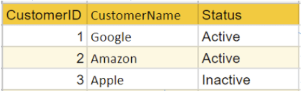
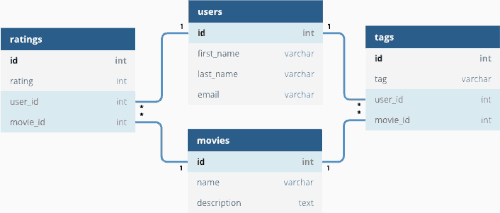
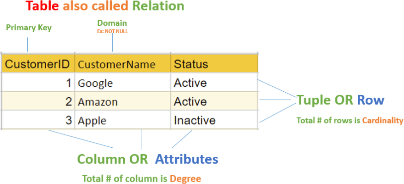
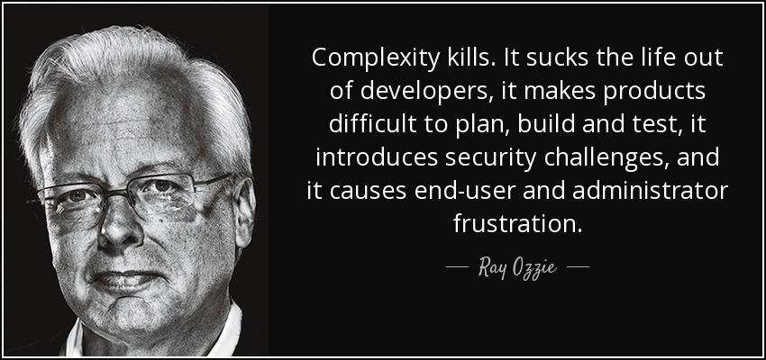
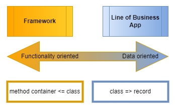

# Geen Titel

## Introductie

Welkom bij dit artikel (deze sessie) die ik express nog geen titel heb gegeven. Mijn naam is Peereflits en werk inmiddels al zo'n 30 jaar als software ontwikkelaar in de IT. En in al die jaren heb ik een aantal ontwikkelingen zien plaatsvinden die zich, na enige contemplatie hierover, in mijn brein zijn gaan nestelen en van daaruit een verhaal zijn gaan spinnen, dat ik jullie graag wil gaan vertellen. Dat verhaal gaat over software, een stukje geschiedenis ervan, programmeer paradigma's en wat de essentie en consequentie hiervan is. 

Ik ga jullie hier geen nieuwe technologieën of technieken leren. Ik hoop jullie alleen meer inzicht te verschaffen in het *waarom* achter de *wat* je doet. Dit artikel dus niet over specifieke computertalen. Enige bekend hiermee is echter wel gewenst. Derhalve is dit artikel bedoeld voor programmeurs  die Java, .NET, C++ en waarschijnlijk ook Python kennen.

Ik weet daarbij heel goed *WAT* ik jullie wil gaan vertellen, maar nog niet goed *HOE*. 

Dit lijkt wel op het verschil tussen [declaratief-](https://nl.wikipedia.org/wiki/Declaratieve_taal) en [imperatief](https://nl.wikipedia.org/wiki/Imperatief_programmeren) programmeren.

> **Note**
> In de informatica worden computertalen ingedeeld in declaratieve talen en imperatieve talen. Heel kort gezegd is  dat men in een declaratieve taal opschrijft *wat* er moet gebeuren, en in een imperatieve taal *hoe* iets moet gebeuren om wat te bereiken. Een volkomen helder onderscheid is niet te maken.

Of op een functie in een imperatieve taal: de signatuur van een functie openbaart "*wat*" het doet; een functie body beschrijft "*hoe*" het dat doet.

Zie bijvoorbeeld de onderstaande functie:

``` java
public int Add(int term1, int term2) {
  return term1 * term2;
}
```

De functie signatuur (de *wat*) vertelt dat het twee getallen optelt en het resultaat (de som) ervan terug geeft. De functie body (de *hoe*) zegt dat zij dit doet door de eerste input variabele te vermenigvuldigen met de tweede.

> **Note**
> Overigens: zien jullie *alle* fouten in de deze code? Het zijn er drie! En deze drie zijn elk te verdelen in een aparte categorie. Ga uit van de aanroep `Add(2147483646, 2);`.
>
> 1. Logisch fout: deze is het gevolg van een verschil tussen *daadwerkelijke* uitkomsten en *verwachte* uitkomsten;<br />
Het resultaat van de functie, afgaande op de naam van de functie, zou `2147483648` moeten zijn, niet `4294967294`.<br/>**PS:** Het meeste venijnige in deze is dat het expliciet mijn bedoeling is om jullie op het verkeerde been te zetten. Als dat is gelukt, dan is de functie dus goed :smile:; Maar natuurlijk is deze "fout" een flagrante schending van het adagium "Use Intention-Revealing Names". Zie pagina 18 in [Clean Code](https://www.amazon.com/Clean-Code-Handbook-Software-Craftsmanship/dp/0132350882).
> 1. Technisch fout: is een fout als gevolg van wijzigingen "in de omgeving" en/of het gebruik waarop niet is geanticipeerd;<br />Wat gebeurt er als de aanroep plaats vindt? Defensief programmeren, goede foutafhandeling en de filosofie hanteren "Never trust public input", zijn methoden om dit soort fouten enigszins tegen te gaan;
> 1. Functioneel fout: is fout wanneer een functie minder kan of doet (of juist te veel kan/doet) dan wat er wordt verwacht.<br />Zie bijvoorbeeld: `Add(1.5, 3.333);` of `Add(1,2,3);`.

Maar goed, ik dwaal af. Ik wilde het gaan hebben over een aantal paradigma's binnen software ontwikkeling.

Overigens: wat is het verschil tussen hardware en software? Met "hardware" maken we een machine die zich gedraagt volgens regels die we niet kunnen veranderen. Met software maken we een machine die zich gedraagt volgens regels die we kunnen aanpassen. "We" is in dit geval dus een "developer". Wees je er derhalve van bewust dat **als je code schrijft die zo slecht onderhoudbaar is dat je deze niet kan wijzigen, dan ben je geen "developer" maar een hardware engineer!**

Met "paradigma" bedoel ik de definitie van "[Programmeerparadigma](https://nl.wikipedia.org/wiki/Programmeerparadigma)" zoals deze op Wikipedia staat:

> Programmeerparadigma's zijn denkpatronen of uitgesproken concepten van programmeren, die voornamelijk verschillen in de wijze van aanpak om het gewenste resultaat te kunnen behalen. Sommige programmeertalen zijn ontworpen om slechts één bepaalde paradigma te ondersteunen, maar er zijn ook andere programmeertalen die meerdere paradigma's ondersteunen (zoals C++, Java en C#).

De thema's die ik wil bespreken zijn:
* Databases
* Object oriëntatie
* Functional programming
* Web programming
* Cloud computing


## Databases

Wie maakt er bij het maken van nieuwe applicaties gebruik van een database? En wie van jullie een *relationele* database?

> **Note**
> Wat is het "relationele" aan een relationele database? Is dat Figuur 1 of Figuur 2?<br/><br/><br/>*Figuur 1*<br/><br/><br/>*Figuur 2*<br/><br/>Het is "Figuur 1": in database parlando heet een tabel een relatie daar de waarde van een veld wordt gevonden op het snijpunt van een tuple en een domain. Het feit dat er tussen tabellen een "foreign key constraint" kan bestaan (figuur 2) is *niet* de reden waarom een relationele database "relationeel" heet; het is omdat het gegevens in een tabel-formaat opslaat.<br/><br/>*Figuur 2*<br/><br/>Zie: [Why are Relational Databases “Relational”?](https://vertabelo.com/blog/why-are-relational-databases-relational/)<br/>Maar dit geheel terzijde :smile:

Waarom gebruiken we relationele databases? 

Omdat relationele databases al zo heel lang bestaan, zijn er, vanaf de jaren '70,  hele generaties programmeurs opgegroeid met de alomtegenwoordige beschikbaarheid van databases als MySQL, Ms Access, SQL Server, Oracle e.a.. Daarbij is ook het denken in tabellen gemeengoed geworden. Dus als "we" denken in termen van "opslaan" van POJO's / POCO's / records / models / entities, dan denken we vrijwel meteen aan "tabellen". En *dus* aan relationele databases. Zelfs met de relatief recente komst van NoSQL databases is dat niet anders (ik kom hier nog op terug).

Misschien moet ik de vraag anders stellen: *Wat* is het probleem dat relationele databases proberen op te lossen? 

Antwoord: dat is het oplossen van het probleem van gestructureerde gegevensopslag. Wat is dat probleem?

Voordat er relationele databases bestonden moesten programmeurs zelf systemen (=databases) met het lezen en schrijven van en naar bestanden (=tabellen) programmeren. Dat was (en is) een heidens karwei. En je kan je voorstellen dat daar vaak fouten in zaten. Naast de tijdrovendheid en foutgevoeligheid van dat karwei was er nog een probleem: schijfruimte in die tijd was heel-heel-heel erg duur.

> **Note**
> Voor een overzicht van disk- & memory storage, zie:
> 
> * https://en.wikipedia.org/wiki/History_of_hard_disk_drives
> * https://www.computerhistory.org/timeline/memory-storage/

In 1970 schreef Dr. Codd ([Edgar F. Codd](https://en.wikipedia.org/wiki/Edgar_F._Codd)) het baanbrekende artikel "[A Relational Model of Data for Large Shared Data Banks](https://learnsql.com/blog/codd-article-databases/)" waarin hij voorstelde om databases op basis van relationele algebra te beschrijven. Dit wordt nu het relationele model genoemd. Dat model had een aantal hele grote voordelen ten opzichte van de toendertijd bekende "network database model" en "hierarchical database model". Network- en hierarchical databases waren erg duur en complex in ontwikkeling en onderhoud. Met het gebruik van het relationele model kon men vele malen eenvoudiger gegevens beheren dan het de oudere modellen. 

Op basis van dit artikel is later [SQL ontstaan](https://learnsql.com/blog/history-of-sql/) en het principe van [database normalisatie](https://en.wikipedia.org/wiki/Database_normalization). Een groot voordeel van data(base)normalisatie is dat je dan de minste schijfruimte nodig hebt om gegevens op te slaan; als je tenminste de derde normaal vorm (3NF) gebruikt. En nogmaals: schijfruimte was in de jaren '70 & '80 heel erg duur.

> **Note**
> Is opslag tegenwoordig goedkoop? Vergeleken met de prijzen van jaren geleden, lijkt het er inderdaad op dat de prijs per GB/TB enorm is gedaald. Maar betekent niet dat wij (= developers) niet meer hoeven na te denken over hoe we zaken in een database opslaan. De kosten van opslag behelzen meer dan alleen de kosten van disk/GB. Denk hierbij ook aan de grootte in geheugen, de grootte "on te wire" en de tijd die nodig is om gegevens (of een bestand) te verwerken!
>
> `More disk size == more read/write time == more throughput == more bandwidth == more memory usage == more energy == more money`
>

De essentie van databases is dat zij "leeft" op de harde schijf; hoewel sommige "disks" weinig meer met schijven de maken hebben, leeft de database, in essentie, op disk (de 'D' in SSD is nog steeds die van "disk"). Dit medium, disk, kent zijn eigen taal: `READ` & `WRITE`. 

> **Note**
> Een "delete" van een bestand op disk bestaat niet. Bij een delete wordt het adres van de bestandsallocatie "uitgegumd" (overschreven met nullen) uit de bestandsallocatietabel (**F**ile **A**llocation **T**able) van het OS waardoor het "gat" in de allocatie weer overschreven kan worden door andere bestanden.

De daarvan afgeleide database taal (SQL) kent zijn eigen grammatica: CRUD.

* **C**reate (INSERT) = Write, append to file
* **R**ead (SELECT) = Read from file
* **U**pdate (UPDATE) = Overwrite in file
* **D**elete (DELETE) = Overwrite with 0000

> **Note**
> CRUD is slechts één van de drie drie taal varianten binnen SQL:
> 1. **DML**: Data Manipulation Language (SELECT, INSERT, UPDATE, DELETE)
> 1. **DDL**: Data Definition Language (CREATE, ALTER, DROP)
> 1. **DAL**: Data Authorization Language (GRANT, REVOKE, DENY)

Het medium "disk" kent zijn eigen taal (r/w) en databases, die "leven" binnen dit medium, hebben een paradigma dat aan dit medium schatplichtig is en daarvan afleiden of overerven. Het database paradigma/taal (SQL) gaat dus, in essentie, over het lezen en schrijven van bestanden naar disk. En het managen van de complexiteit hiervan is het oplossen van het probleem van gestructureerde gegevensopslag.

Dat er niet zoiets als "overerving" bestaat in databases, is omdat dit een concept is dat niet van toepassing is in het probleemdomein van "gestructureerde gegevensopslag".

De *reason d'être* van "disk" is om "durable" state (persistente sate) mogelijk te maken.

> **Note**
> ### NoSQL Databases
> Toen het probleem van "dure schijfruimte" steeds minder een probleem werd, als gevolg van de ontwikkelingen op dat gebied, en in samenhang met de toegenomen rekenkracht en interconnectiviteit tussen systemen, begon de hoeveelheid gegevens die in databases terecht kwam te groeien tot een hoeveelheid die een decennium ervoor nog niet voor mogelijk werd gehouden. En niet alleen de *hoeveelheid* data werd steeds meer een uitdaging. Ook ontstond steeds meer de behoefte om "ongestructureerde" data (zoals bijvoorbeeld PDF documenten) te kunnen "queriën".
> 
> Als gevolg van deze behoefte begonnen een aantal grote tech bedrijven te experimenten met en te bouwen aan grote gedistribueerde databases. Dit betekende het einde van de hegemonie van de relationele database; lees: SQL. En zo ontstond de **N**ot-**O**nly-**SQL** beweging met zijn [verschillende soorten databases](https://www.geeksforgeeks.org/types-of-nosql-databases/ "Types of NoSQL Databases"), die elk weer op hun beurt een specifiek persistentie probleem proberen op te lossen.
>
> Voor meer info:
> * [Difference between SQL and NoSQL](https://www.geeksforgeeks.org/difference-between-sql-and-nosql/)
> * [The CAP Theorem in DBMS](https://www.geeksforgeeks.org/the-cap-theorem-in-dbms/)

## Object oriëntatie

Wie van jullie maakt er bij het maken van nieuwe applicaties gebruik van een objectgeoriënteerde taal en/of framework? En vooral, *waarom* gebruiken jullie deze? 

Voor de hand liggende antwoorden zijn: dit is wat ik heb geleerd op school of in de praktijk; dit wordt gebruikt bij de klant/in het project; Maar waarom wordt dit gedoceerd op opleidingen? Het wordt gevraagd door de industrie. En waarom vraagt de industrie om objectgeoriënteerde talen?

Om een probleem op te lossen! De aanvoerder van de oplossing heet niet voor niet "Solution Architect". Welk probleem? Wat voor probleem?

Object oriëntatie is een antwoord op het probleem van toenemende complexiteit.

> Goede object oriëntatie is het efficient toepassen van een effectieve verdeel- en heerstactiek op complexiteit.<br /><cite>-- Marcel --</cite>

Om te begrijpen wat die complexiteit behelst, moeten we eerst de geschiedenis van computers en hun programmeertalen eens bekijken.

### De geschiedenis van toenemende complexiteit

> In the beginning when we had no computers, we had no problems.<br />Then when we had small computers, we had small problems.<br />Now that we have big computers, we have big problems.<br /><cite>-- Edsger W. Dijkstra --</cite>

Toen de eerste computers werden ontwikkeld, bestond het beroep "software ontwikkelaar" niet. De eerste programma's die werden geschreven bestonden vooral uit een enorme sequentie van uitgeschreven processor instructies. Het scopen van routines was slechts mogelijk door het toepassen van `GOTO` statements. Hierdoor waren computer programma's nauwelijks leesbaar en werd dit soort code al snel "spaghetti code" genoemd. De programma's werden geschreven in o.a. [assembly/assembler language](https://en.wikipedia.org/wiki/Assembly_language), vroege versies van BASIC, Fortran of COBOL. Batch files zijn nog een voorbeeld van [non-structured programming](https://en.wikipedia.org/wiki/Non-structured_programming), zoals de talen uit die tijd ('50/'60) werden genoemd. Een belangrijk kenmerk van code uit die tijd was de scoping van routines door `GOTO`.

<aside style="background-color:#666;padding:1em;margin-bottom:1em;">

**Terzijde:** De basis van elke programmeertaal bestaat uit drie "[programming constructs](https://www.bbc.co.uk/bitesize/guides/z433rwx/revision/1)": [sequentie, selectie & iteratie](https://www.101computing.net/sequencing-selection-iteration/).

</aside>

Om de problemen van "spaghetti code" het hoofd te kunnen bieden werden er aan computer talen [block structures](https://en.wikipedia.org/wiki/Block_(programming))" en [subroutines (functions)](https://en.wikipedia.org/wiki/Function_(computer_programming)) toegevoegd. En zo ontstond "[structured programming](https://en.wikipedia.org/wiki/Structured_programming)". Een belangrijk kenmerk van "Structured programming" is dat routines gescoped worden door "functions" en/of subroutines.

<aside style="background-color:#666;padding:1em;margin-bottom:1em;">

**Terzijde:** De Nederlands professor [Edsger W. Dijkstra](https://en.wikipedia.org/wiki/Edsger_W._Dijkstra) valt de eer ten deel de term "structured programming" te hebben uitgevonden.

</aside>

En toen was het leven weer mooi. Totdat ...

Zoals jullie weten kan je aan functies parameters meegegeven. En hier begint het sprookje van structured programming scheuren te vertonen.

Functie modules uit die vroege tijd waren (soms) enorme libraries met niets anders dan alleen maar (publieke) methodes. Windows libraries als `kernel32.dll` en `user32.dll` zijn nog steeds niets anders dan grote bakken met "procedurele" functies. En als een methode/functie meer of andere functionaliteit moest gaan ondersteunen, dan werden er vaak parameters aan een functie toegevoegd om die functionaliteit te kunnen ondersteunen.


<aside style="background-color:#666;padding:1em;margin-bottom:1em;">

**Terzijde:** Ik ben ooit eens een methode tegen gekomen (in Visual Basic) waarbij de signatuur uit 22 parameters bestond en 2409 karakters lang was om te lezen. De functie body was een enorme spaghetti van `If-Then-Else`-en en loops. Deze was meer dan 800 regels lang. :cry:

</aside>

Nu weten we allemaal dat als het aantal parameters van een functie toeneemt, de [cyclomatische complexiteit](https://en.wikipedia.org/wiki/Cyclomatic_complexity) navenant toeneemt == toenemende complexiteit. En we weten ook: **Complexity kills!**

<br /><cite>-- Ray Ozzie --</cite>

Toen een aantal knappe koppen hierover nadachten, ontstond het idee: als we nu eens het gedrag en de bijbehorende data van een functionaliteit (= één functie) zouden kunnen encapsuleren in één construct, één ding, één object ... ? En voilà: hier heb je "object oriëntatie".

### Object oriëntatie (OO) 101

[Object oriëntatie](https://en.wikipedia.org/wiki/Object-oriented_programming) is al "uitgevonden" in de jaren '60. Maar het duurde tot eind jaren '80 voordat OO echt gemeengoed werd. Ook wordt OO tegenwoordig anders begrepen dan in haar ontstaansfase. Zaken als "inheritance" & "polymorphism" zijn geen concepten in de oorspronkelijke opzet van OO. Zie [The Forgotten History of OOP](https://medium.com/javascript-scene/the-forgotten-history-of-oop-88d71b9b2d9f). Dat er tegenwoordig anders over wordt gedacht is o.a. een gevolg van het feit dat veel OO-talen inmiddels multi-paradigmale computertalen zijn geworden.

Wie weet wat de vier uitgangspunten van OO zijn? Zoek maar eens op internet naar "four tenets/pillars/principles of object oriented programming" en je krijgt dit lijstje:
* Encapsulation
* Abstraction
* Inheritance
* Polymorphism

De definities die veelal worden gegeven bij elk van deze begrippen worden vaak van andere bronnen overgenomen. En daardoor is er volgens mij informatie verloren gegaan die kan bijdragen aan het beter begrijpen van OO (in de tegenwoordige context).

#### Over Encapsulation

Dit wordt veelal gedefinieerd als dat de interne representatie van een object (=state) niet zichtbaar is buiten het object. Gewoonlijk kunnen alleen de eigen methoden van het object (=state) de velden rechtstreeks inspecteren of manipuleren. Vaak wordt in één adem met encapsulatie "acces modifiers" (`public`, `internal`, `protected`, `private`) genoemd als de manier waarop dit wordt gerealiseerd. 

Maar dat is slechts een deel van het verhaal. Encapsulatie gaat, mijns inziens, over het inkapselen van gedrag en de daarmee corresponderende data in één construct. Het probleem bij structured programming was dat methoden/functies steeds meer parameters kregen waardoor de complexiteit toenam. Door de parameters van een functie als losse fields/properties op te nemen in een construct, kan de functie vereenvoudigen (en mogelijk meerdere functies worden). En dat "construct" kennen we in OO-talen als `class`. 

<aside style="background-color:#666;padding:1em;margin-bottom:1em;">

**Terzijde:** Naar mate een applicatie meer een "Line of Business" applicatie is, worden classes meer data-georiënteerd (record-like). Wanneer een library meer framework-achtige trekken krijgt, krijgen `classes` een meer functie georiënteerd karakter waarin de uitgangspunten van OO beter tot hun recht komen.



</aside>

#### Over Abstraction, Inheritance en Polymorphism

> OO Design principle: Program against abstractions, not concretions.

Over "Abstractie" wordt vaak iets geroepen als dat het iets is dat gemodelleerd is naar iets uit te "echte" werkelijkheid. Soms wordt ook nog het concept "interface" genoemd. "Inheritance" definieert een "is-een" of "heeft-een" relatie tussen objecten (een vis "is-een" dier). En "Polymorphism" is een "het-kan" relatie tussen objecten (een vogel kan vliegen). 

> Voor elk probleem is in OO wel een juist abstractie niveau te vinden. Behalve voor het probleem van teveel abstracties.<br /><cite>--- Een uitspraak van [The Problem Solver](https://www.theproblemsolver.nl/) ---</cite>

Maar daar gaat het helemaal niet om! Deze drie begrippen gaan maar over één ding: contract! Zowel abstractie (=interface) als overerving en polymorfisme worden in Java en .NET/C# op dezelfde manier uitgedrukt. 

``` csharp
public interface ICanFly { ... }

public abstract class Animal { ... }

public abstract class Mammal: Animal { ... }

public class Bat: Mammal, ICanFly { ... }
```

Er wordt in alle drie de gevallen gebruik gemaakt van de inheritance operator "`:`". Waarom? Het gaat in alle gevallen om het gegeven dat een `class` aan een contract voldoet. En waarom is *dat* dan zo belangrijk?

Toen OO een grote vlucht begon te nemen, werd "inheritance" bejubeld als één van haar meest belangrijkste features. Maar dit jubelen werd vooral gedaan door IT-managers die "inheritance" vooral vertaalde in herbruikbaarheid. In de documentatie van Microsoft wordt dit nog steeds aangehaald:

> Inheritance enables you to create new classes that reuse, extend, and modify the behavior defined in other classes.<br /><cite>-- [bron: microsoft](https://learn.microsoft.com/en-us/dotnet/csharp/fundamentals/object-oriented/inheritance) ---</cite>

Ik maak een functionaliteit (= `class`). Jij wilt deze functionaliteit ook, maar dan net even iets anders. Dan overerf je mijn class en pas je het gedrag aan naar jouw smaak en hoef je niet zelf alles opnieuw te schrijven (inclusief de bugs) en breek je bestaande implementaties niet. Zie hier: herbruikbaarheid door "inheritance".

De developer blij want eenvoudig (ahum). De manager blij want de developer is sneller klaar (met minder bugs). Bedrijf blij, want sneller = goedkoper.

> OO Design principle: Favor polymorphism over inheritance.

Maar er zit nog een ander verhaal achter deze "inheritance" / herbruikbaarheid. En deze begint bij de vraag: waar "leeft" een (in een OO-taal geschreven) programma? In welk medium?

Programma's leven primair in het RAM-geheugen van een computer. Dat zal niemand verbazen. Computertalen en compilers moeten dus slim kunnen omgaan met geheugen en het beheren ervan. De werkelijk reden achter de contract georiënteerdheid van OO zit in het feit dat met "fixed contracts" geheugenblokken beter zijn te beheren. 

En hier begint mijn redenatie wankel te worden. Ik heb jaren geleden een artikel gelezen dat de start betekende van dit verhaal. Dat artikel kan ik helaas niet meer terugvinden. Vooral één van de afbeeldingen erbij was voor mij een eye-opener. Het eerste kwartje viel!

In dat artikel legde de auteur uit dat in een objecten-hiërarchie van overerfde objecten in een OO-programmeertaal (C++?) delen van geheugenblokken werden hergebruikt omdat zij dezelfde geheugen-layout deelden. Iets met pointers, structs en v-tables enzovoort. In de afbeelding eronder was dit schematisch zeer verhelderend uitgetekend. Het hebben van dezelfde geheugen-layout was mogelijk doordat er aan een "contract" werd voldaan (een vis "is-een" dier). Hierdoor konden geheugenblokken worden gedeeld en werd geheugenruimte genormaliseerd (lees: als in database-normalisatie). Deze normalisatie leidde dan tot kleinere memory-footprint en dat was weer voordelig. Want in die tijd was geheugen duur en zeker niet onbeperkt adresseerbaar (wie kent de 640Kb limiet in MS-Dos nog?).

<aside style="background-color:#666;padding:1em;margin-bottom:1em;">
Het managen van het geheugen is iets wat gemakkelijk fout kan gaan wanneer je dat zelf moet doen (lees: null-pointers). In o.a. C++ kan dit nog steeds. Het is duidelijk zien in de beschikbare methoden om zelf geheugenblokken te kunnen alloceren/de-alloceren en het kunnen werken mat pointers(*) en geheugenadressen (&). Java & .NET/C# zijn ook "expres" uitgevonden om o.a. dit probleem op te lossen.
</aside>

>	OO is about managing state

Van OO wordt ook wel gezegd dat het gaat om het managen van state. Inheritance = herbruikbaarheid van functionaliteit + herbruikbaarheid van code + herbruikbaarheid van geheugen.

Een kenmerk van (RAM-)geheugen is dat zij zeer vluchtig is. `RAM =  volatile state`. De grammatica van het managen deze "volatile state" bestaat uit begrippen als: heap, stack, struct, v-table, allocation, de-allocation, GC, lock e.a.. en is een zeer complexe aangelegenheid. [Object oriëntatie](https://nl.wikipedia.org/wiki/Objectgeori%C3%ABnteerd) is o.a. een poging een antwoord te geven op dit complexe probleem.


## Functional programming (FP)

Met de komst van F# in .NET staat [Functional programming](https://nl.wikipedia.org/wiki/Functioneel_programmeren) weer iets meer in de belangstelling in de wereld van software ontwikkeling. De belangstelling is ook toegenomen doordat de ontwikkelingen in hardware functionele programmeertalen makkelijker maken.

Maar waarom zijn er functionele talen (en het bijbehorende paradigma) nodig? De vraag die gesteld moet worden, is dus weer: welk probleem lost FP op?

Toen ik eens, jaren geleden, een sessie bij [gebruikersgroep dotNed](https://www.dotned.nl/) bijwoonde, waarin [Oliver Sturm](https://www.linkedin.com/in/oliversturm/) het één en ander over FP uitlegde, viel het tweede kwartje.

### Het probleem van OO

In OO, zoals we hiervoor hebben kunnen zien, wordt gedrag en "state" geëncapsuleerd in een `class`. En de interne state van een object mag natuurlijk niet worden geopenbaard aan de buitenwereld. De interne state mag alleen gewijzigd worden door de publieke methoden (mutators) van een object. En deze mutators dienen dan ook zeer nauwgezet de parameters te inspecteren en de interne state te valideren voordat de state wordt gewijzigd. Programmeren is mensenwerk (ondanks de recente komst van ChatGPT). En mensen maken fouten. De state van een object wordt vaker "gelekt" dan lief is, wat weer allerlei side-effects doet ontstaan, wat weer fouten oplevert, wat weer kosten/ergernis/complexiteit ... You get the drill.

Managing state is complex. En "OO is about managing state". Enter Functional programming

### Het Functionele paradigma 101

Het paradigma van functioneel programmeren bestaat uit elimineren van state door "alles" te beschrijven in de vorm van functies. Maar zijn we dan weer terug bij structured programming?, hoor ik jullie al denken. Maar nee. Dit paradigma is gebaseerd op de wiskundige theorie van de [Lambdacalculus](https://nl.wikipedia.org/wiki/Lambdacalculus). Het is een hoger niveau van denken, begrijpen en berekenen waarbij functies geen side-effects hebben want deze functies kennen geen state (in FP ook wel "pure functions" genoemd). En de parameters van een functie kunnen ook als functie worden beschreven (ook wel [currying](https://en.wikipedia.org/wiki/Currying) genoemd). Oftewel: een functie kan ook een andere functie als argument kan meekrijgen. Functies in FP zijn veelal referentieel transparant. Dit houdt in dat een expressie vervangen kan worden door zijn waarde zonder de werking van het programma te veranderen.

Dit is in een hele kleine notendop de essentie van FP. Ik weet dat ik aan een heleboel theorie ervan voorbij ga. Maar de crux van FP zit in het feit dat doordat een functie (op het allerlaagste niveau) stateless is, zijn er geen side-effects waardoor FP-programma's veel makkelijker haar berekeningen parallel uit kan voeren.

In FP "leeft" een functie dus op de processor. En met de komst van multi-core processoren kan FP het probleem van inefficiënt processor gebruik (ongebruikte processor capaciteit) oplossen.

Wil je meer weten over FP/F#? [F# for Fun and Profit](
https://fsharpforfunandprofit.com/) is een site die mij (destijds) veel inzicht hierin heeft gegeven.


## Web programming

Internet is niet meer uit ons leven weg te denken. Sterker nog: een ieder die dit leest, dankt (direct of indirect) zijn brood eraan. Velen van ons werken aan web api's of het consumeren ervan.

Maar wat is het aan internet dat het zo immens populair is geworden? Eén van de grootste problemen die internet oplost, is de lokaliteit van data.<br />**NB:** Op technisch niveau lost het het probleem van PRC (remote procedure call) op.

In de begindagen van de grote computers ('50-'70) moesten programmeurs op hun fiets, met in hun hand een broodtrommel met pons-kaarten, naar een rekencentrum om hun code de laten compileren en uit te voeren. Mainframes hadden terminals waar programmeurs naar toe moesten gaan om iets van een computer gedaan te krijgen. 

In de jaren '80, met de komst van de PC, werd dit probleem deels verholpen. Na de Mainframe, ontstonden nu client-server systemen. Met name bij "fat-clients" rees het probleem: hoe krijg ik een nieuwe versie van mijn client applicatie op de PC van de gebruiker? Spoiler alert: internet!

<aside style="background-color:#666;padding:1em;margin-bottom:1em;">

**Terzijde:** de mission statement van Microsoft in '80 & `90 was: A computer on every desk and in every home.<br />Zie: https://www.businessinsider.nl/microsoft-ceo-satya-nadella-bothered-by-bill-gates-mission-2017-2

</aside>

De opkomst van internet (in Nederland [in de jaren '90](https://nl.wikipedia.org/wiki/Geschiedenis_van_het_internet_in_Nederland "Geschiedenis van het internet in Nederland")) was, met "a computer on every desk and in every home", de beschikbaar het van internet voor het grote publiek door ISP's en [Mosaic](https://nl.wikipedia.org/wiki/Mosaic_(browser)) niet meer te stuiten. 

Door de groeiende beschikbaarheid van computers, kabels, (gestandaardiseerde) protocollen en applicaties (browsers en servers) kon internet ontstaan. Internet betekende, en betekent, dat "alle" informatie voor "iedereen", overal beschikbaar is. Die publieke alomtegenwoordigheid van informatie werkt ook als een [democratiserende kracht](https://assets.cambridge.org/97811070/49130/excerpt/9781107049130_excerpt.pdf "The internet as a democratising force"). 

Internet betekende ook dat het deployment probleem bij client-server applicaties kon worden opgelost. En met de toenemende volwassenheid en functionaliteit in protocollen (HTML5) en applicaties (=browsers) zijn client-server systemen op sterven na dood[\*].

Dus rest ons applicaties te ontwikkelen "op internet". Deze applicaties bestaan uit een client[\*] deel (front-end) en een server[\*] deel (back-end), waarbij elk deel zijn eigen technologieën/talen/frameworks tot haar beschikking heeft. Dat lijkt natuurlijk niet handig. Maar beide verschillen omdat zij beide verschillende problemen oplossen: de client app "leeft" in de browser op het beeldscherm; de backend applicatie "leeft" in het geheugen van een server.

[\*] De term/begrip "client-server" blijft rudimentair toch bestaan.

<aside style="background-color:#666;padding:1em;margin-bottom:1em;">

De front-end stack bestaat uit drie verschillende technologieën die ieder een eigen verantwoordelijkheid hebben ten aanzien van de inhoud: 

* HTML = Structure of content (declaratief)
* CSS = Layout of content (declaratief)
* JS/WASM = Behaviour of content (imperatief)

</aside>

Maar de essentie van een web applicatie is, dat zij "leeft" op de kabel (Wifi is een virtuele kabel). En een kabel is stateless. In een kabel kan een signaal alleen van de client naar de server of van de server naar de client gaan. En hiermee is het Request/Response model een feit.

De grammatica van Request/Response bestaat uit [ABC](https://en.wikipedia.org/wiki/Windows_Communication_Foundation):

* **A**ddress: dit is de URL van het endpoint. *Waar* vindt ik de resource;
* **B**inding: specificeert de te gebruiken communicatie- & beveiliging protocols. *Hoe* bevraag ik de resource;
* **C**ontract:  definieert de interface van de resource. *Wat* kan ik van de resource vragen;

De kabel lost een lokaliteitsprobleem op. Daarvoor gebruikt het een taal (ABC) die dat kan adresseren. Daarom kent web-programming (aan haar randen) niet zoiets als polymorfisme, overerving e.a.. Zie het onderstaande code voorbeeld:

``` java
@GetMapping("/articles")
public VehicleSearchResponseDto articles(
   @RequestParam(required = false) String category,
   @RequestParam(required = false) String vehicleType,
   @RequestParam(required = false) String brand,
   @RequestParam(required = false) String model,
   @RequestParam(required = false) Integer page,
   @RequestParam(required = false) Integer limit
) {
   VehicleSearchRequestDto dto = new VehicleSearchRequestDto(category, vehicleType, brand, model, productionYearRange, version, keyword, page, limit);
   return vehicleService.searchArticles(dto);
}
```

De `@GetMapping("/articles")` adresseert een deel van de de A van de ABC. Maar een "request object", als complex type, bestaat niet in een kabel. Daarom moeten de *parameters* van het request als querystring parameters worden gedefinieerd voordat deze over een kabel kunnen worden aangeleverd aan de server. Frameworks als Java Spring en ASP.NET doen veel om de "paradigm mismatch" weg te poetsen maar ergens blijft het altijd schuren als je de grens van een paradigma (= de grens van een medium) oversteekt. In dit geval gaat het van OO naar Web (lees: van geheugen naar kabel). In geval van database interactie is het van OO naar RDBMS (lees: van geheugen naar disk).

> Crossing the boundaries of a paradigm always aches due to a paradigm mismatch (like the object-relational mismatch).

<aside style="background-color:#666;padding:1em;margin-bottom:1em;">

In zowel Java/spring als in .NET core wordt tegenwoordig alleen nog als binding JSON over HTTP gebruikt. Protocols als SOAP over HTTP, SOAP over TCP en SOAP over MQ zijn in onbruik geraakt. Als *contract* is [OpenAPI](https://www.openapis.org/) in zwang geraakt.

**NB:** SOAP gebruikte WSDL als contract taal.

</aside>

Hoewel een kabel stateless is van nature, kennen web applicaties een hybride form van state die ook wel "sticky state" wordt genoemd. Hierbij wordt de state in een request verschaft door het gebruik van HTTP headers, query strings, cookies of request body (POST/PUT only). Hierbij ligt de state bij de client van de web applicatie en leunt deze op de statefulness van het apparaat (=desktop/laptop/tablet/smartphone).

Zal de toekomst uit gaan wijzen dat FP-talen OO-talen gaan vervangen omdat zij beter aansluiten op het Web-programming paradigma daar FP en internet/HTTP beide stateless van nature zijn?


## Cloud computing

Over Cloud computing wordt veel geschreven: het is immers hip & happening. En hoewel ik hierover nog het nodige kan vertellen, ga ik vertellen wat andere reeds hebben geblogd, gepodcast of gestreamed.

Dus maar meteen: Waarom Cloud computing? Om het probleem van ongebruikte hardware op te lossen. 

Het opzetten van een goed serverpark is duur; en deze niet volledig benutten is nog duurder (een hogere TCO). Organisaties geven vaker de voorkeur aan [OpEx boven CapEx](https://github.com/undergroundwires/Azure-in-bullet-points/blob/master/AZ-900%20Microsoft%20Azure%20Fundamentals/6.2.%20Capital%20Expenditure%20(CapEx)%20vs%20Operational%20Expenditure%20(OpEx).md). Zie daarom deze welbekende onderstaande afbeelding:

[](https://www.bmc.com/blogs/saas-vs-paas-vs-iaas-whats-the-difference-and-how-to-choose/)

Cloud computing "leeft" in een Data center/rekencentrum. Haar grammatica bestaat o.a. uit: public-, private- & hybrid cloud, IAAS, PAAS, SAAS, open standaarden, platform onafhankelijkheid, MPP, AI, Big Data.

Cloud computing maakt door een ongekende beschikbaarheid van compute + storage mogelijk dat technologieën als AI (artificial intelligence - een betere term zou "artificial cleverness" zijn), Big Data en MPP (massive parallel processing) tot wasdom komen.

Wordt de "next big wave" [Quantum computing](https://en.wikipedia.org/wiki/Quantum_computing)? Daar moet ik nog eens rustig over nadenken.


## Afronding & Afsluiting

Samenvattend kom ik tot de volgende conclusies:

Een paradigma probeert een probleem op te lossen van het medium waarop het "leeft" en gebruikt hierbij een taal die daarvan afhankelijk is. Het medium is een een onderdeel van de computer zoals geheugen, disk, processor, IO/(netwerk-)kabel (of zelfs de hele computer zelf in geval van cloud computing). Het op te lossen probleem heeft vaak de maken met "state". En het heeft altijd te maken met geld want de oplossing is (uiteindelijk) efficiënter en kosten effectiever.

Applicaties gebruiken veelal meerdere paradigma's. En:

> Crossing the boundaries of a paradigm always aches due to a paradigm mismatch (like the object-relational mismatch).

* Disk = durable state
* Memory = volatile state
* Processor = no state
* Wire = no state (backend) / sticky state (frontend)
* Cloud = massive state

Waarom gebruiken we:
1. **Databases**: om efficiënter en kosteneffectiever schemagebonden (gestructureerde) gegevens op durable state (= disk) te beheren
1. **NoSQL**:     om efficiënter en kosteneffectiever niet-schemagebonden (ongestructureerde) gegevens op (gedistribueerde) durable state te beheren
1. **OO**:        om efficiënter en kosteneffectiever gegevens/complexiteit in volatile state (= geheugen) te beheren
1. **FP**:        om efficiënter en kosteneffectiever data/functionaliteit te beheren zonder state (= processor)
1. **Web**:       om efficiënter en kosteneffectiever locatie ongebonden gegevens te beheren zonder state (= kabel)
1. **Cloud**:     om efficiënter en kosteneffectiever computers (serverparken) te beheren (datacenter)

<br /><br />

---

Enjoy coding<br />Stay curious<br />Keep thinking

---

## Referenties

In volgorde van verschijning in de tekst:

* https://nl.wikipedia.org/wiki/Declaratieve_taal
* https://nl.wikipedia.org/wiki/Imperatief_programmeren
* https://www.amazon.com/Clean-Code-Handbook-Software-Craftsmanship/dp/0132350882
* https://nl.wikipedia.org/wiki/Programmeerparadigma
* https://opentextbc.ca/dbdesign01/chapter/chapter-7-the-relational-data-model/
* https://vertabelo.com/blog/why-are-relational-databases-relational/
* https://en.wikipedia.org/wiki/History_of_hard_disk_drives
* https://www.computerhistory.org/timeline/memory-storage/
* https://en.wikipedia.org/wiki/Edgar_F._Codd
* https://learnsql.com/blog/codd-article-databases/
* https://learnsql.com/blog/history-of-sql/
* https://en.wikipedia.org/wiki/Database_normalization
* https://www.geeksforgeeks.org/types-of-nosql-databases/
* https://www.geeksforgeeks.org/difference-between-sql-and-nosql/
* https://www.geeksforgeeks.org/the-cap-theorem-in-dbms/
* https://en.wikipedia.org/wiki/Assembly_language
* https://en.wikipedia.org/wiki/Non-structured_programming
* https://www.bbc.co.uk/bitesize/guides/z433rwx/revision/1
* https://www.101computing.net/sequencing-selection-iteration/
* https://en.wikipedia.org/wiki/Block_(programming)
* https://en.wikipedia.org/wiki/Function_(computer_programming)
* https://en.wikipedia.org/wiki/Structured_programming
* https://en.wikipedia.org/wiki/Edsger_W._Dijkstra
* https://en.wikipedia.org/wiki/Cyclomatic_complexity
* https://en.wikipedia.org/wiki/Object-oriented_programming
* https://medium.com/javascript-scene/the-forgotten-history-of-oop-88d71b9b2d9f
* https://learn.microsoft.com/en-us/dotnet/csharp/fundamentals/object-oriented/inheritance
* https://nl.wikipedia.org/wiki/Objectgeori%C3%ABnteerd
* https://nl.wikipedia.org/wiki/Functioneel_programmeren
* https://nl.wikipedia.org/wiki/Lambdacalculus
* https://en.wikipedia.org/wiki/Currying
* https://fsharpforfunandprofit.com/
* https://www.businessinsider.nl/microsoft-ceo-satya-nadella-bothered-by-bill-gates-mission-2017-2
* https://nl.wikipedia.org/wiki/Geschiedenis_van_het_internet_in_Nederland
* https://nl.wikipedia.org/wiki/Mosaic_(browser)
* https://assets.cambridge.org/97811070/49130/excerpt/9781107049130_excerpt.pdf
* https://en.wikipedia.org/wiki/Windows_Communication_Foundation
* https://www.openapis.org/
* https://github.com/undergroundwires/Azure-in-bullet-points/blob/master/AZ-900%20Microsoft%20Azure%20Fundamentals/6.2.%20Capital%20Expenditure%20(CapEx)%20vs%20Operational%20Expenditure%20(OpEx).md
* https://www.bmc.com/blogs/saas-vs-paas-vs-iaas-whats-the-difference-and-how-to-choose/
* https://en.wikipedia.org/wiki/Quantum_computing
